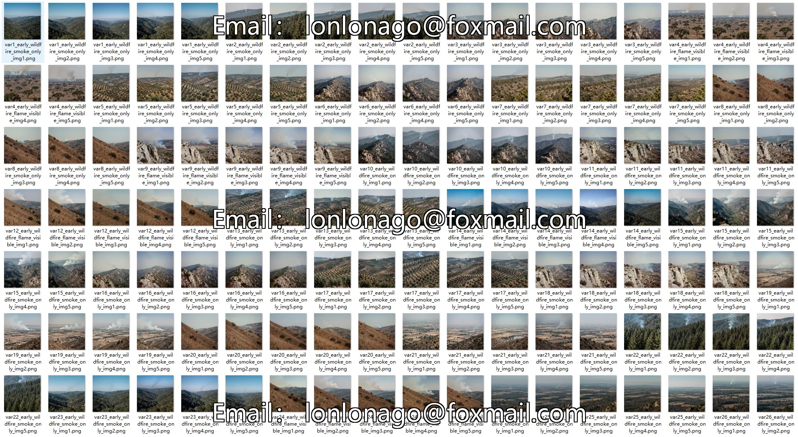
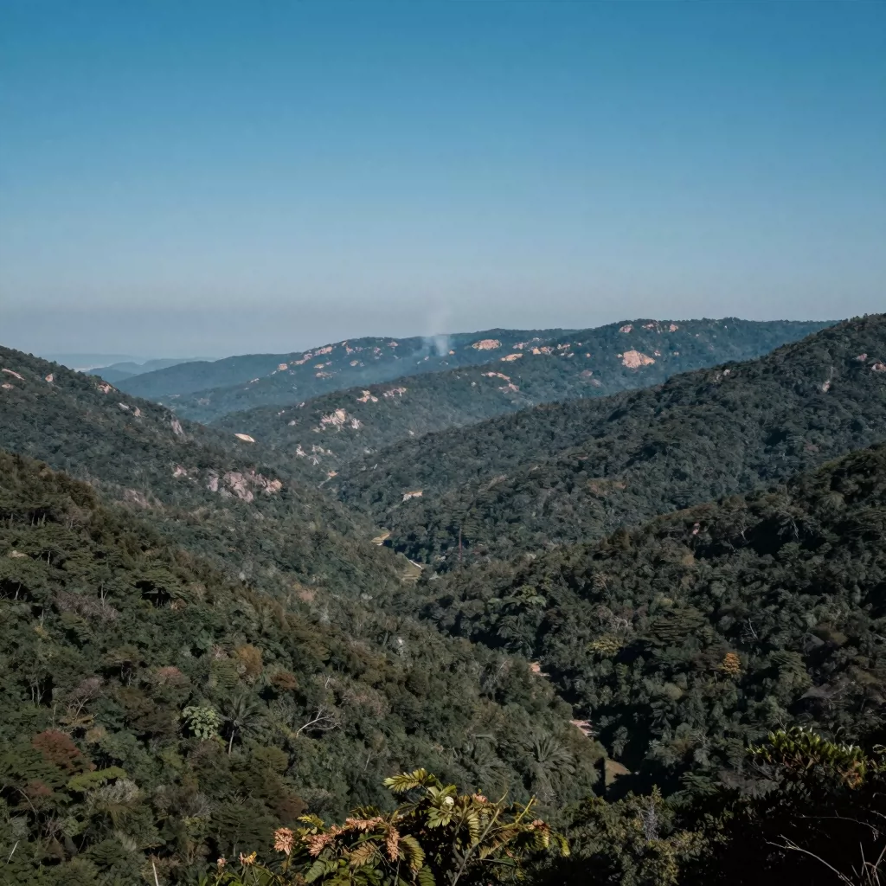
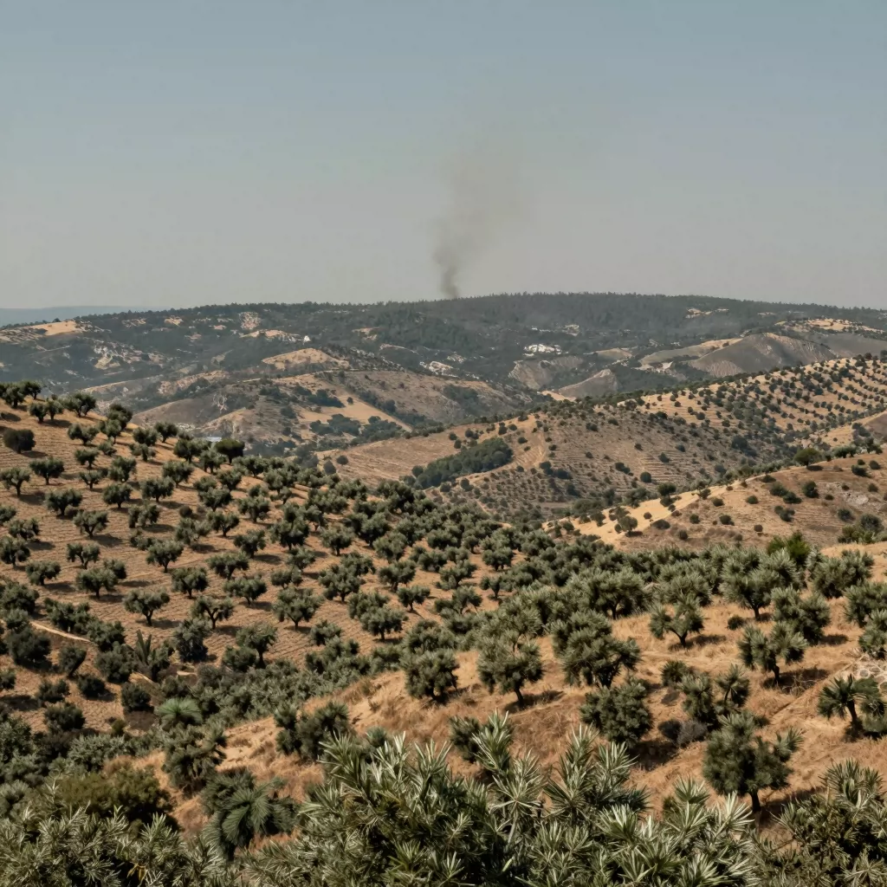
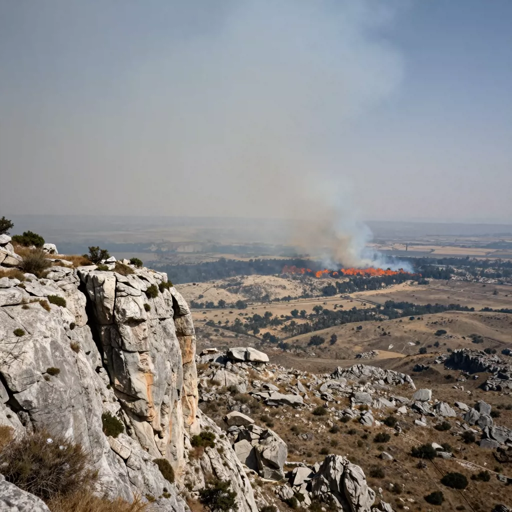
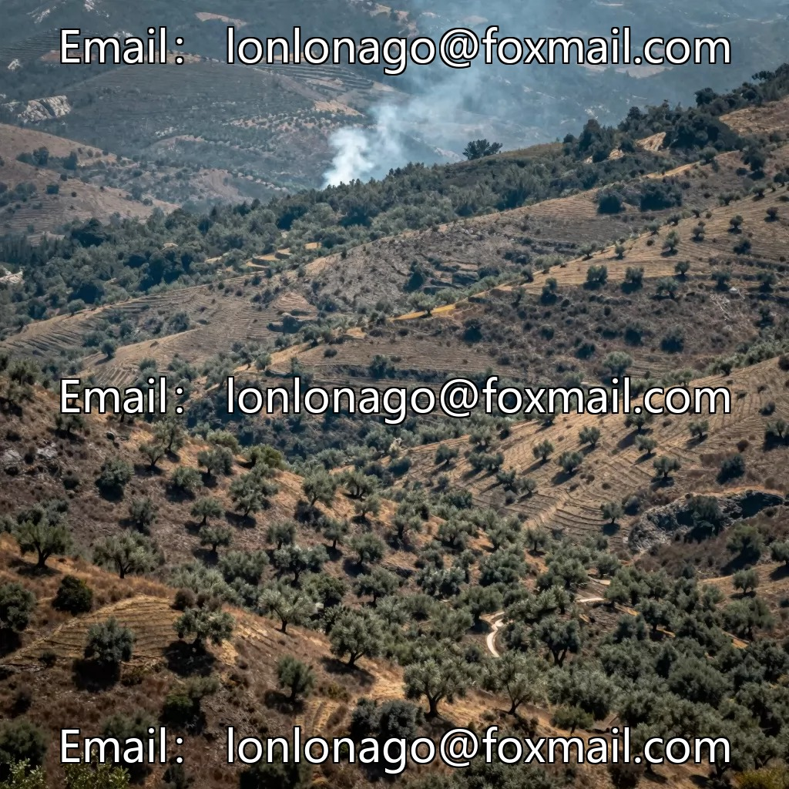

## Body

Remote Wildfire and Smoke Detection Dataset in YOLO format

A total of 240 high-resolution images are available, labeled in YOLO format. The training set (240)

The dataset is divided into two categories: smoke wildfire. This set of 240 images comes from the Simuletic Wildfire series

Long-range perspective: specifically captured from simulated elevated locations (fire lookout towers, mountain tops) to simulate remote monitoring.
Real-world class distribution: 90% of the dataset focuses on smoke, reflecting the most common real-world detection scenarios, namely fires that have not yet manifested.

Electronic virtual products sold without return or exchange.

## Images

item_1056017263666

Here is a pay link on Stripe ( https://buy.stripe.com/3cs8yP7sY87d0vu9AB ). Please contact me lonlonago@foxmail.com after funding $89, and I will send you a complete data files , thank you!

